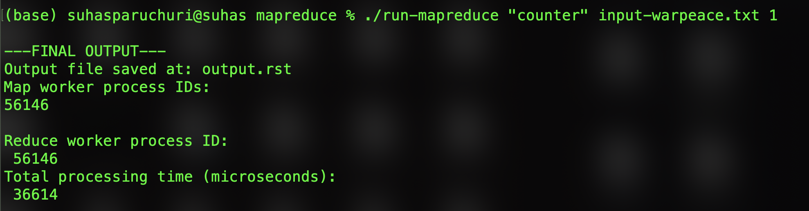
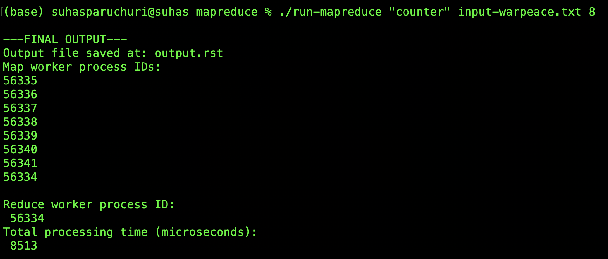

# MapReduce Data Processing
## Project Overview
This project implements a MapReduce programming model,for parallel and scalable processing of large datasets. The framework splits input data, processes it concurrently, and aggregates results efficiently.

### **Tasks Implemented**
1. **Letter Counter**: Counts the frequency of each letter in the input data.
   - Input: Text file.
   - Output: Letter frequencies.

2. **Word Finder**: Finds lines containing a specific word in the input data.
   - Input: Text file and target word.
   - Output: Lines containing the target word.

---

## Key Features
- Parallel Processing via forked child processes for mapping tasks.
- Intermediate Data Storage using temporary partition files (namely `partion-*.itm`).
- Large Input Support by dividing data into configurable splits.
- Robust Error Handling for file I/O, memory allocation, and process failures.
- Customizable map and reduce functions to process diverse datasets.

---
## **Compilation**
To build the project, use the provided `Makefile`. Run the following command:
```bash
make
```
For Counter task
```
./run-mapreduce <mode> <input_file> <split_num>
```
For Finder task
```
./run-mapreduce <mode> <input_file> <split_num> [word_to_find]
```
Arguments
```
mode           # Task to execute: "counter" for letter counting or "finder" for word search
input_file     # Path to a regular input text file
split_num      # Number of chunks to split the input file into for parallel map processes
word_to_find   # (Only for "finder" mode) Word to search for in the input file
```
Examples
```
./run-mapreduce "counter" input-warpeace.txt 8
./run-mapreduce "finder" input-warpeace.txt 8 "Revolution"
```
---
## **Performance**
- **1 Process**

VS 
- **8 Processes**

Executing on multiple processes isn't always beneficial, for example - small inputs because the overhead of process creation, I/O, and merging results outweighs the minimal computation time, making sequential execution faster.  <br>
`Sometimes let one process shine, no backup dancers required :)`
```
a:210858
b:36749
c:63180
d:117755
e:313171
f:54497
g:53054
h:171161
i:172657
j:2485
k:22650
l:96051
m:61289
n:183139
o:191489
p:49163
q:2320
r:151191
s:162131
t:224512
u:64916
v:26787
w:58932
x:4034
y:45944
z:2387
```
---
Finder Task
```
./run-mapreduce "finder" input-warpeace.txt 8 "Revolution"
```
Outputs the lines that contain the word `Revolution`
```
from the Revolution leaving the people to anarchy, and Napoleon             
alone understood the Revolution and quelled it, and so for the general      
because he rose superior to the Revolution, suppressed its abuses,          
great man. The Revolution was a grand thing!" continued Monsieur            
  "What? Revolution and regicide a grand thing?... Well, after that...      
liberty and equality. Have people since the Revolution become happier?      
house with its gigantic mirrors, pre-Revolution furniture, powdered         
an autocratic government in Russia, or a Revolution in France and a         
the French Revolution, and so on. Without each of these causes nothing      
Revolution. The words that had struck him in the Emperor's appeal-          
calling these sayings and doings "the Revolution"; then they give a         
The sum of human wills produced the Revolution and Napoleon, and            
of the Revolution general progress or anything else- then it is             
been attained without the Revolution and without the Empire. If the         
  And beginning with the French Revolution the old inadequately             
the Revolution, of the ideas of 1789 and so forth, and at another           
Napoleon's caprice. The ideas of the Revolution and the general temper      
suppressed the ideas of the Revolution and the general temper of the        
of the French Revolution resulting from the doctrine of the equality        
during the French Revolution they guillotined one another.                  

```


